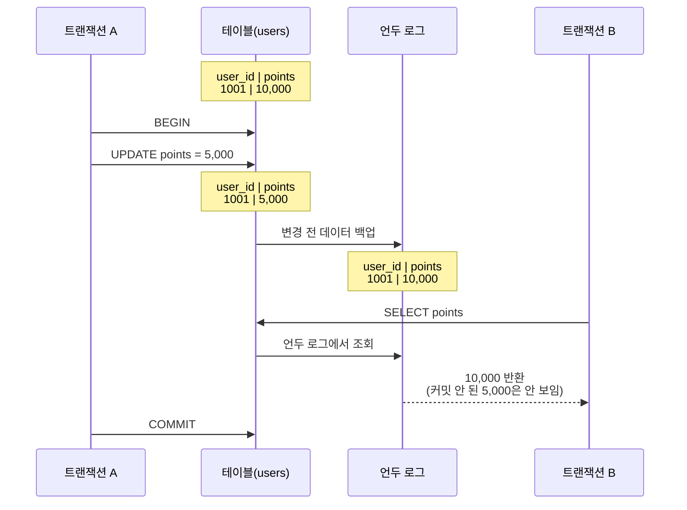
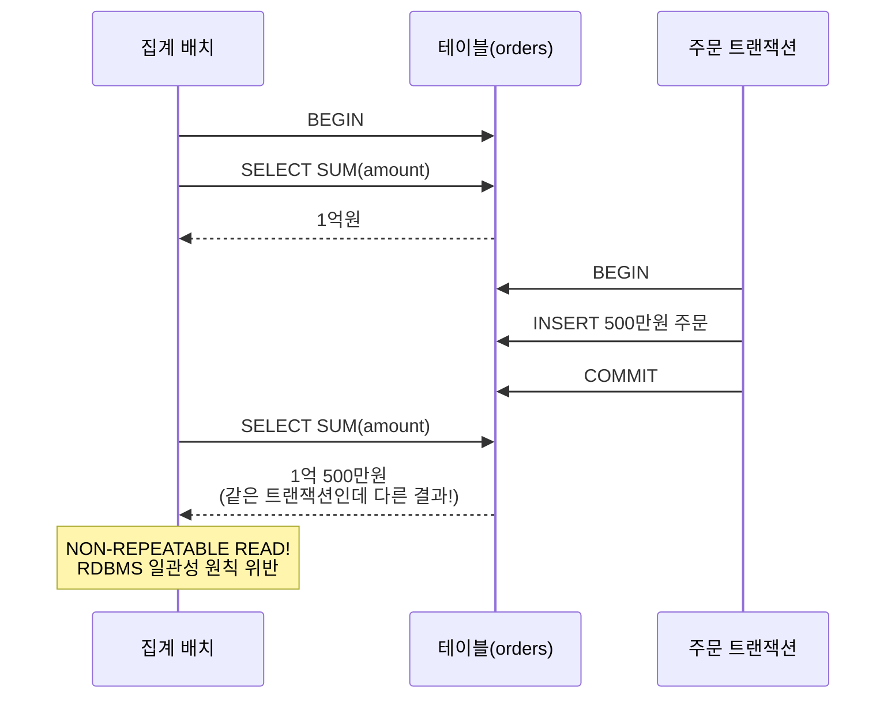
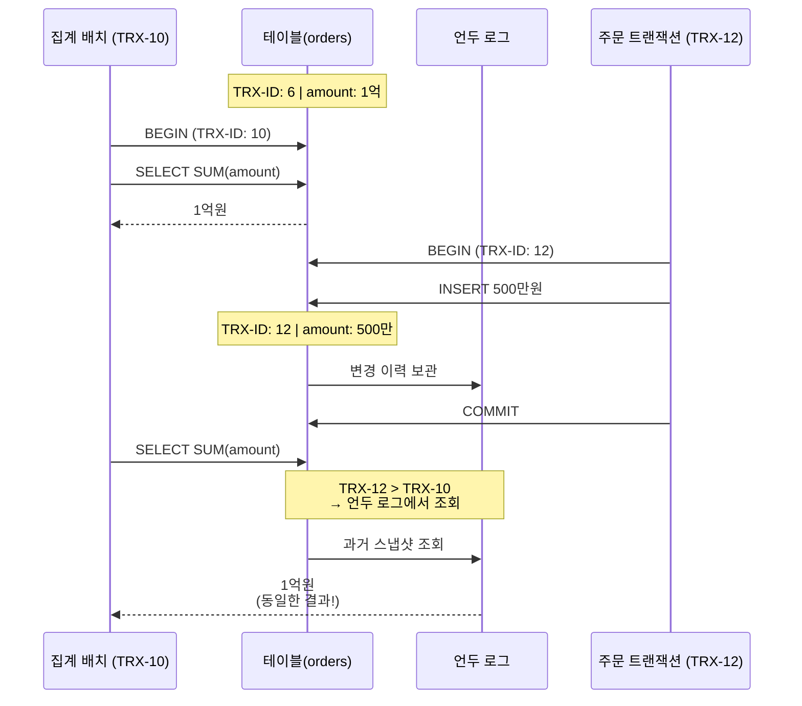
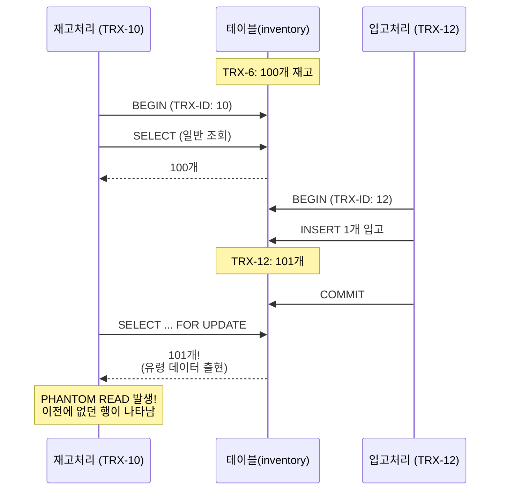

# 트랜잭션과 잠금
## MySQL 잠금 메커니즘
MySQL 엔진을 설계하는 개발자라고 생각하고 다음 질문의 답을 찾아보겠습니다.
"여러 트랜잭션이 같은 레코드를 동시에 수정하면 데이터 정합성이 깨지기 때문에 락 메커니즘이 필요합니다. 어떻게 락 메커니즘을 설계해야할까요?"

### 테이블 락
가장 단순한 방법은 테이블 전체를 잠그는 것입니다.
```sql
LOCK TABLES employees WRITE; 
UPDATE employees SET salary = 100000 WHERE emp_no = 10001; 
UNLOCK TABLES;
```

이 방법은 한 명의 직원 급여를 수정했는데 전체 직원 테이블이 잠깁니다. 다른 직원의 정보를 조회하거나 수정하려는 모든 요청이 대기해야합니다. 즉, 동시성과 성능이 크게 떨어집니다.

### 레코드 자체에 락
그렇다면 필요한 레코드에만 잠그면 되지 않을까요 ?
```
레코드 10001번 🔒 (A가 수정 중) 
레코드 10002번 ✅ (B가 동시 수정 가능) 
레코드 10003번 ✅ (C가 동시 수정 가능)
```

이 방법은 동시성과 성능을 지키면서 정합성을 지키기에 완벽해보입니다. 그런데 레코드를 어떻게 식별할 수 있을까요 ?

#### 문제 1. 물리적 위치는 변한다.
데이터베이스에서 레코드는 `페이지`단위로 저장됩니다. "레코드 10001번은 페이지 5의 3번째 슬롯에 있어" 이런 식으로 물리적 위치로 식별할 수 있을까요?
``` 
페이지 5: [10001, 10002, 10003, 10004, ...] 
```

아니요 !
- INSERT로 데이터가 늘어나면 페이지 분할이 발생합니다.
- DELETE로 데이터가 줄어들면 페이지 병합이 발생합니다.
  즉, 레코드의 물리적 위치가 계속 변합니다. 락은 **트랜잭션이 끝날 때까지 유지**되어야 하는데, 그 사이 레코드의 물리적 위치가 바뀔 수 있습니다.

#### 문제2. 레코드를 어떻게 찾을 것인가?
락을 걸기 전에 먼저 어떤 레코드를 잠글 것인가?를 결정해야 합니다.
```sql
UPDATE employees 
SET salary = 100000 
WHERE first_name = 'Georgi' AND last_name = 'Klassen';
```
이 쿼리를 실행하면 데이터베이스는:
1. 조건에 맞는 레코드를 검색해야 합니다.
2. 찾은 레코드에 락을 걸어야 합니다.

데이터베이스는 쿼리를 실행할 때 항상 `인덱스`를 기준으로 레코드를 탐색합니다.
```
쿼리 실행 흐름: WHERE 조건 → 인덱스 탐색 → 레코드 발견 → 락 필요!
```

여기서 결정적인 아이디어가 나옵니다. 레코드를 찾는 경로인 인덱스를 기준으로 락을 걸면 어떨까요 ?

### 인덱스 기반 락
mysql은 다음과 같은 이유로 인덱스 기반 락을 선택하였습니다.

1. 인덱스는 논리적이고 안정적이다.
```
인덱스: first_name + last_name 
- ('Georgi', 'Klassen') → 이 값은 변하지 않습니다 
- 페이지가 분할되거나 병합되어도 인덱스 값은 동일합니다 
- 물리적 위치가 변해도 논리적 의미는 유지됩니다
```

2. 탐색 경로와 잠금 대상이 일치합니다.

```
쿼리 실행: 
WHERE first_name='Georgi' 
    → first_name 인덱스 탐색 
    → 탐색한 인덱스 엔트리에 락 설정 
    → 자연스러운 흐름!
```


하지만 인덱스 락도 부작용은 존재합니다.
```sql
mysql> SELECT COUNT(*) FROM employees WHERE first_name='Georgi';
+----------+
| 253      |
+----------+

  

mysql> SELECT COUNT(*) FROM employees WHERE first_name='Georgi' AND last_name='Klassen';

+----------+
| 1        |
+----------+

mysql> UPDATE employees SET hire_date = NOW() WHERE first_name='Georgi' AND last_name='Klassen';
```
1건의 레코드만 업데이트되니까 1건만 잠기겠지? 라고 생각하셨나요?

실제로는 253건의 레코드가 모두 잠깁니다. 왜 그럴까요? 인덱스가 first_name만 있다고 가정하면:
```
UPDATE 실행 과정: 
1. first_name='Georgi' 인덱스 탐색 
	→ 253개 인덱스 엔트리 발견 
2. 각 엔트리를 하나씩 확인하며 last_name='Klassen' 체크 
   → 탐색한 모든 인덱스 엔트리에 락 설정됨 
3. 최종적으로 last_name이 'Klassen'인 1건만 업데이트 
   → 하지만 락은 253건 모두에 걸림
```

그래서 MySQL에서 인덱스 전략은 정말 중요합니다.

# 트랜잭션
- 데이터베이스의 작업 단위로 데이터 정합성을 보장하기 위한 기능

## 트랜잭션 격리 수준
트랜잭션 격리 수준을 포인트 차감 로직을 통해 살펴보겠습니다
### 문제 발생: 포인트 이중 차감
한 사용자가 5,000포인트를 사용해 상품을 구매했는데, 포인트가 10,000포인트나 차감되었다는 것입니다.
```kotlin
// 문제가 있는 코드
fun deductPoints(userId: Long, amount: Int) {
    val user = userRepository.findById(userId)
    if (user.points >= amount) {
        user.points -= amount
        userRepository.save(user)
    }
}
```
이 코드는 언뜻 보면 문제가 없어 보입니다. 하지만 두 개의 트랜잭션이 동시에 실행되면 어떻게 될까요?


### 원인 분석: 더티 리드 문제
문제의 핵심은 **트랜잭션 A가 변경한 데이터를 커밋하기 전에, 트랜잭션 B가 그 데이터를 읽을 수 있다**는 점이었습니다. 이를 **더티 리드(Dirty Read)**라고 합니다.
1. 트랜잭션 A: 사용자 포인트 10,000 조회 → 5,000 차감 → **아직 커밋 안 함**
2. 트랜잭션 B: 사용자 포인트 **5,000 조회** (A가 변경한 값) → 5,000 차감
3. 결과: 포인트가 10,000이 차감됨

MySQL에서는 이 문제를 어떻게 해결할까요 ?

### 해결 1단계: READ COMMITTED - 언두 로그 활용
MySQL의 **READ COMMITTED** 격리 수준은 커밋되지 않은 데이터를 읽지 못하도록 차단합니다. 비밀은 **언두 로그(Undo Log)**에 있습니다.



1. 트랜잭션 A가 포인트를 차감하면, 변경 전 값(10,000)이 언두 로그에 자동으로 백업됩니다
2. 트랜잭션 B가 조회할 때는 테이블의 5,000이 아니라 언두 로그의 10,000을 읽습니다.
   즉, A가 커밋하기 전까지 B는 변경 전 값만 볼 수 있습니다. 이렇게 더티 리드 문제 해결! 이중 차감이 방지됩니다.


### 문제 발생2: 집계 데이터가 매번 달라집니다
일일 매출 집계 배치가 실행될 때마다 결과가 달라지는 문제가 발생하였습니다.
```kotlin
@Transactional
fun calculateDailySales(date: LocalDate): SalesReport {
    val morning = orderRepository.sumByDate(date)  // 1억원
    
    // 중간에 다른 로직 처리...
    Thread.sleep(1000)
    
    val afternoon = orderRepository.sumByDate(date)  // 1억 500만원???
    
    // 두 값이 달라서 검증 실패
    require(morning == afternoon) { "데이터 불일치!" }
}
```
같은 트랜잭션 안에서 같은 쿼리를 실행했는데 결과가 다릅니다. 왜 그럴까요?


### 원인 분석: Non-Repeatable Read 문제
READ COMMITTED 격리 수준에서는 **다른 트랜잭션이 데이터를 커밋하면, 같은 트랜잭션 내에서도 그 변경사항이 즉시 보입니다**.


RDBMS의 핵심 원칙 중 하나는 **일관성(Consistency)**입니다. 같은 트랜잭션에서 같은 쿼리는 항상 같은 결과를 반환해야 합니다. 하지만 지금은 그렇지 않습니다.

### 해결 2단계: REPEATABLE READ - 트랜잭션 스냅샷
MySQL의 기본 격리 수준인 **REPEATABLE READ**는 이 문제를 **트랜잭션 ID 기반 스냅샷**으로 해결합니다. 핵심 아이디어는 간단합니다: **"내 트랜잭션이 시작된 시점의 데이터만 보겠다"**



각 트랜잭션은 시작할 때 고유한 ID(TRX-ID)를 받습니다. 데이터를 읽을 때는 **"나보다 작은 트랜잭션 ID가 변경한 데이터만"** 봅니다.


### 마지막 장애: 재고 관리에서 유령 데이터 출현
재고 관리 시스템에서 이상한 현상이 발견되었습니다.
```kotlin
@Transactional
fun lockAndProcessInventory(warehouseId: Long) {
    // 1차 조회: 재고 100개 확인
    val items = inventoryRepository
        .findByWarehouseId(warehouseId)  // 100개
    
    processItems(items)
    
    // 2차 조회: 잠금을 걸고 최종 확인
    val lockedItems = inventoryRepository
        .findByWarehouseIdForUpdate(warehouseId)  // 101개???
        
    // 어디서 1개가 생겼지??
}
```
같은 트랜잭션에서 첫 번째 조회에서는 100개, 잠금을 걸고 조회하니 101개가 나왔습니다.

### 원인 분석: Phantom Read 문제
문제는 **SELECT ... FOR UPDATE**를 사용한 순간 발생했습니다.


**왜 이런 일이 발생할까요?**
`SELECT ... FOR UPDATE`는 레코드에 **쓰기 잠금**을 걸어야 합니다. 그런데 언두 로그의 과거 데이터에는 잠금을 걸 수 없습니다(이미 지나간 데이터니까요). 그래서 어쩔 수 없이 **현재 테이블의 실제 데이터**를 읽게 되고, 결과적으로 새로 INSERT된 레코드(TRX-12)도 함께 보이게 됩니다.

이렇게 같은 트랜잭션 내에서 이전에 없던 행이 갑자기 나타나는 현상을 **Phantom Read(유령 읽기)**라고 합니다.