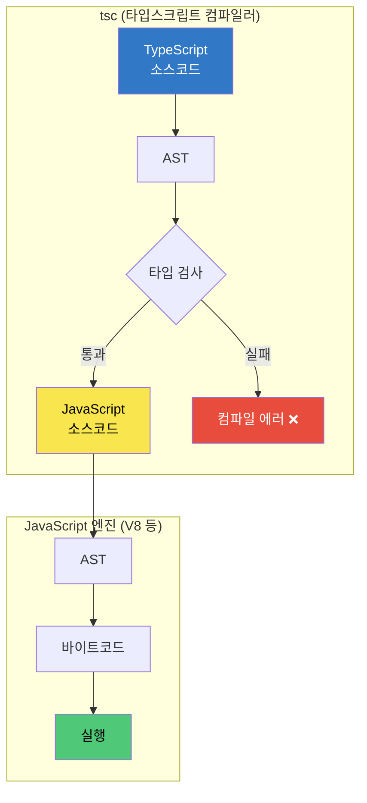

# 타입스크립트는 어떻게 동작할까?

우리가 작성하는 코드를 컴퓨터는 직접 이해하지 못한다. 그래서 프로그래밍 언어를 기계가 실행할 수 있는 형태로 변환하는 과정이 필요한데, 이를 **컴파일(Compile)**이라고 한다.

그렇다면 타입스크립트는 어떤 과정을 거쳐 최종적으로 실행될까? 이를 이해하려면 먼저 JavaScript의 컴파일 과정을 알아야 한다.

---

## JavaScript의 컴파일 과정

JavaScript 엔진(예: V8)은 코드를 다음 두 단계로 처리한다.

1. **소스 코드 → AST 변환**: 코드 문자열을 AST(Abstract Syntax Tree, 추상 문법 트리)로 파싱한다. AST란 코드의 구조를 트리 형태로 표현한 것으로, `if`, `function`, `=` 같은 문법 요소가 노드가 된다.
2. **AST → 바이트코드 변환**: AST를 바이트코드(가상 머신이 실행할 수 있는 중간 단계의 명령어)로 변환하여 실행한다.

---

## TypeScript의 컴파일 과정

타입스크립트는 JavaScript의 과정 **앞에** 자체 컴파일 단계가 추가된다. 핵심은 **타입 검사를 수행한 뒤, 타입 정보를 모두 제거하고 순수한 JavaScript를 출력**한다는 점이다.

1. **TypeScript 소스코드 → AST 변환**: 타입스크립트 컴파일러(`tsc`)가 `.ts` 코드를 AST로 파싱한다.
2. **타입 검사**: AST를 기반으로 타입이 올바른지 검사한다. 오류가 있으면 이 단계에서 컴파일 에러가 발생한다.
3. **JavaScript 출력**: 타입 정보를 제거하고 순수한 JavaScript 코드를 생성한다.

이렇게 만들어진 JavaScript는 다시 JavaScript 엔진의 일반적인 과정을 거친다.

4. **JavaScript → AST 변환**
5. **AST → 바이트코드 변환 및 실행**

---

## 정리

- TypeScript는 **런타임에 존재하지 않는다**. 컴파일 시점에 타입을 검사하고, 최종 산출물은 순수한 JavaScript다.
- 즉, 타입스크립트의 타입 시스템은 **개발 단계의 안전장치**이지, 실행 성능에 영향을 주지 않는다.
- 컴파일 파이프라인: `TS 소스 → AST → 타입 검사 → JS 소스 → AST → 바이트코드`
